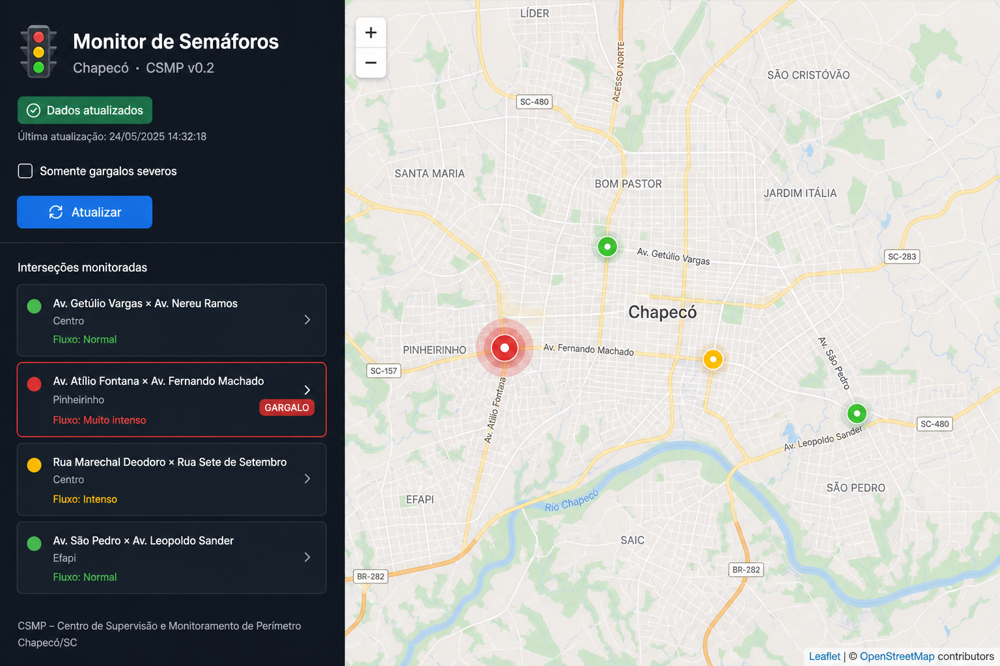

# Chapecó Smart Mobility Platform (CSMP)

An open-source, event-driven **traffic semaphore monitor** for Chapecó, SC — built
incrementally and **spec-first**. This is a learning/portfolio monorepo.

**Repository:** https://github.com/floydianfan77/csmp-platform



*The Phase 6 map UI: Leaflet markers per intersection, pt-BR labels, bottleneck
highlights, and a sidebar fed by the FastAPI monitor API over DuckDB core tables.*

## Vision

```
                +------------------------+
   (simulator)  |       producer         |   <-- Phase 2 ✅
   telemetry -->|  traffic events v1    |
                +-----------+------------+
                            |
                            v
                +------------------------+
                |      Redpanda          |   <-- Phase 2 ✅
                | chapeco-traffic-events |
                +-----------+------------+
                            |
                            v
                +------------------------+
                |   stream aggregation   |   <-- Phase 3 ✅
                |   (1-min windows)      |
                +-----------+------------+
                            |
                            v
                +------------------------+
                |   landing + dbt core   |   <-- Phase 3–4 ✅
                | (SQLite / DuckDB dev)  |
                +-----------+------------+
                            |
                            v
                +------------------------+
                |   monitor-api          |   <-- Phase 5 ✅
                |   (FastAPI + OpenAPI)  |
                +-----------+------------+
                            |
                            v
                +------------------------+
                |   monitor-ui           |   <-- Phase 6 ✅
                |   (Leaflet map, pt-BR) |
                +------------------------+
```

## Repository layout

```
Semaphores Project/
├── specs/                   # Requirements, contracts, acceptance (source of truth)
├── services/
│   ├── producer/            # Phase 2: simulator → Kafka
│   ├── flink-job/           # Phase 3: 1-min windows → landing
│   ├── dbt/                 # Phase 4: staging + core + GIS
│   ├── monitor-api/         # Phase 5: FastAPI read API
│   └── monitor-ui/          # Phase 6: Leaflet map (static, served at /app/)
├── tests/
│   ├── contract/            # Phase 1 — schema / OpenAPI / warehouse tests
│   └── acceptance/          # AT-001 … AT-006 end-to-end scenarios
├── docs/                    # Manual, roadmap, ADRs, devlog, assets
├── infra/                   # docker-compose (Redpanda)
├── pyproject.toml
├── Makefile.ps1             # Windows dev commands
├── demo.bat                 # Load sample data (double-click)
└── run-monitor.bat          # Open map + start API (double-click)
```

## Design principles

1. **Spec-first.** Contracts in `specs/contracts/` before producer, Flink, or API code.
   Every change traces to `FR-*` / `NFR-*` IDs.
2. **Contract-tested.** CI validates JSON Schema, OpenAPI, warehouse YAML, and seeds —
   no broker required for Phase 1 tests.
3. **Correct realtime semantics.** Signal state = last event in window by timestamp;
   freshness SLAs define "realtime" (≤120s to API).
4. **Independently deployable services.** Each folder in `services/` is self-contained.
5. **Local-first.** Redpanda + SQLite landing + DuckDB warehouse; BigQuery is the cloud target.

## Quick start (contract tests — no Docker)

```powershell
pip install -e ".[dev]"
pytest tests/contract -v
# or
.\Makefile.ps1 test-contract
```

Expected: **22+ passed**. No Docker or cloud credentials needed.

## See the map (full local stack)

**First time:** double-click **`demo.bat`** (starts Redpanda, publishes sample events,
builds `data/csmp.duckdb`).

**Then:** double-click **`run-monitor.bat`** — opens the map at
**http://127.0.0.1:8000/app/** and API docs at `/docs`.

From PowerShell:

```powershell
.\Makefile.ps1 demo
.\Makefile.ps1 monitor-api
```

Redpanda console: http://localhost:8080 — bootstrap `localhost:19092`.


## Documentation

- [`docs/MANUAL.md`](docs/MANUAL.md) — the full study guide (every phase, deep-dived).
- [`docs/roadmap.md`](docs/roadmap.md) — the live roadmap.
- [`docs/architecture.md`](docs/architecture.md) — living architecture doc.
- [`specs/README.md`](specs/README.md) — requirements + contract index.

## Project history

Every work session is logged in [`docs/devlog.md`](docs/devlog.md) — decisions,
what was built, and why. It's the canonical record of how this project evolved.

## Roadmap

See [`docs/roadmap.md`](docs/roadmap.md). Short version:

- [x] **Phase 0** — Spec approval + GitHub Spec Kit
- [x] **Phase 1** — Contract tests (JSON Schema, OpenAPI, warehouse, seeds)
- [x] **Phase 2** — Redpanda + producer simulator + AT-001
- [x] **Phase 3** — Stream aggregation → SQLite landing (AT-002)
- [x] **Phase 4** — dbt core + bottleneck flag + GIS enrichment (AT-003, AT-005)
- [x] **Phase 5** — Monitor API (FastAPI + AT-004)
- [x] **Phase 6** — Map UI (Leaflet + pt-BR + AT-006)

## Spec Kit (Cursor)

Skills in `.cursor/skills/`: `/speckit-tasks`, `/speckit-implement`, `/speckit-analyze`.
Human specs in `specs/` remain canonical.
