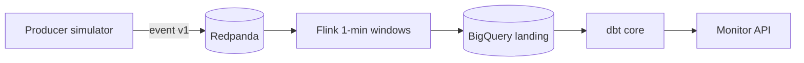

# CSMP — Project Manual

A complete, study-oriented guide to the **Chapecó Smart Mobility Platform** built
incrementally in Python. It explains the *why* behind every decision, the *concepts*
you need to understand it, and the *how* to run it yourself.

> **What is this project?** A small but realistic platform that ingests traffic signal
> telemetry from Chapecó intersections, aggregates it in near-realtime, and exposes a
> **monitor API** showing current signal state and congestion bottlenecks. Built step by
> step as a learning + portfolio project — **spec-first**.

---

## Table of contents

1. [The big picture](#1-the-big-picture)
2. [Architecture at a glance](#2-architecture-at-a-glance)
3. [Technology stack](#3-technology-stack)
4. [Core concepts glossary](#4-core-concepts-glossary)
5. [Repository structure](#5-repository-structure)
6. [Phase 0 — Specification](#6-phase-0--specification)
7. [Phase 1 — Contract tests](#7-phase-1--contract-tests)
8. [Phase 2 — Local ingest (preview)](#8-phase-2--local-ingest-preview)
9. [Phase 3 — Stream aggregation (preview)](#9-phase-3--stream-aggregation-preview)
10. [Phase 4 — Warehouse core / dbt (preview)](#10-phase-4--warehouse-core--dbt-preview)
11. [Phase 5 — Monitor API (preview)](#11-phase-5--monitor-api-preview)
12. [Running what exists today](#12-running-what-exists-today)
13. [Python & engineering concepts learned](#13-python--engineering-concepts-learned)
14. [Roadmap (what's next)](#14-roadmap-whats-next)
15. [What this project demonstrates](#15-what-this-project-demonstrates)

---

## 1. The big picture

### The real-world problem

City traffic operations need a trustworthy view of **semaphore state** and **congestion**
across intersections. Raw telemetry arrives continuously — too fast and too noisy to show
directly on a dashboard. CSMP builds the machinery to:

- ingest per-intersection events,
- aggregate them into **1-minute windows**,
- enrich with map coordinates,
- flag **severe bottlenecks** (long stops + very low speed),
- expose a **monitor API** with freshness guarantees.

### Why "event-driven"?

| Style | How it works | Problem |
|-------|--------------|---------|
| **Batch polling** | Cron job pulls files every N minutes | Stale data; tight coupling to sources |
| **Event-driven** | Producers publish to a **broker**; consumers process at their own pace | Decoupled, replayable, scalable |

The broker is a **replayable log**: reading an event does not delete it. Flink can
reprocess history; a future analytics service can read the same stream independently.

### Why "spec-first"?

This project defines **contracts before code**:

- Kafka event JSON Schema
- Warehouse landing table columns (Flink INSERT order matters!)
- Monitor API OpenAPI
- Acceptance scenarios (Given/When/Then)

Phase 1 runs **contract tests** so broken specs are caught before anyone writes Flink SQL.

---

## 2. Architecture at a glance

```
                +------------------------+
   (simulator)  |      producer          |   Phase 2  (producer)
   telemetry -->|  traffic events v1     |
                +-----------+------------+
                            | JSON events
                            v
                +------------------------+
                |      Redpanda          |   Phase 2  (event backbone)
                |  chapeco-traffic-events|
                +-----------+------------+
                            |
                            v
                +------------------------+
                |   PyFlink SQL job      |   Phase 3  (1-min windows)
                |  LAST_VALUE state      |
                +-----------+------------+
                            |
                            v
                +------------------------+
                | BigQuery landing       |   Phase 3
                | traffic_signals_       |
                | aggregated_stream      |
                +-----------+------------+
                            |
                            v
                +------------------------+
                |   dbt staging + core   |   Phase 4
                |  bottleneck + GIS join |
                +-----------+------------+
                            |
                            v
                +------------------------+
                |   monitor-api          |   Phase 5
                |   FastAPI (read-only)  |
                +-----------+------------+
                            |
                            v
                +------------------------+
                |   monitor UI (map)     |   Phase 6 (optional)
                +------------------------+
```



### Data flow in one sentence

The **producer** emits validated traffic events to **Redpanda**; **Flink** aggregates
them into 1-minute buckets; **dbt** enriches and flags bottlenecks; the **monitor API**
returns the latest state per intersection within a **120-second freshness SLA**.

---

## 3. Technology stack

| Concern | Choice | Why |
|---------|--------|-----|
| Language | **Python 3.10+** | Readable; matches portfolio |
| Spec / SDD | **GitHub Spec Kit** + `specs/` | Traceable FR/NFR; Cursor skills |
| Event contract | **JSON Schema** | Language-neutral; testable |
| API contract | **OpenAPI 3.1** | Document + validate responses |
| Broker | **Redpanda** | Kafka protocol; light local dev |
| Stream processing | **PyFlink SQL** | SQL windows; event time |
| Warehouse (cloud) | **BigQuery** | Native GIS (`ST_GEOGPOINT`) |
| Transform | **dbt** | Tests, lineage, incremental merge |
| Monitor API | **FastAPI** | OpenAPI-first; same as FinOps step 5 |
| Testing | **pytest** | Contract + acceptance tests |
| CI | **GitHub Actions** | Phase 1: contract tests only |

---

## 4. Core concepts glossary

### Domain (traffic / smart mobility)

- **Intersection** — a traffic signal node (inventory from OSM + fallback seed).
- **Signal state** — `GREEN`, `RED`, `YELLOW`, `FLASHING_YELLOW`, `UNKNOWN`.
- **Window** — 1-minute tumbling bucket on **event time** (`environment.timestamp`).
- **Bottleneck** — `stop > 75s` **and** `speed < 5 km/h` in the same window (FR-004).
- **Monitor** — read API (+ future map UI) showing **latest** state per intersection.

### Stream processing

- **Event time vs processing time** — when something happened vs when Flink processed it.
- **Watermark** — Flink's "we're probably caught up to here" clock for late events.
- **Tumbling window** — fixed, non-overlapping buckets (here: 1 minute).
- **LAST_VALUE by timestamp** — correct way to pick signal state in a window (not `MAX(string)`).
- **At-least-once** — duplicates possible; core dbt layer uses **idempotent merge**.

### Spec-driven development

- **FR / NFR** — functional / non-functional requirement IDs (`FR-001`, `NFR-001`).
- **Acceptance test (AT-xxx)** — Given/When/Then scenario proving a requirement.
- **Contract test** — validates JSON/OpenAPI/YAML artifacts without full pipeline running.

### Event-streaming (same as FinOps)

- **Topic** — named stream (`chapeco-traffic-events`).
- **DLQ** — dead-letter topic for invalid JSON (Phase 2).
- **Retention** — how long events stay on the log (enables replay).

---

## 5. Repository structure

```
Semaphores Project/
├── specs/                        # Source of truth (requirements + contracts)
│   ├── 01-requirements.md        # FR-001..005, NFR-001..005
│   ├── 02-architecture.md
│   ├── 03-implementation-plan.md # Phases 0–6
│   ├── acceptance/               # AT-001 .. AT-005
│   └── contracts/
│       ├── events/               # Kafka JSON Schema
│       ├── warehouse/            # Landing table contract
│       ├── api/                  # Monitor OpenAPI
│       └── seeds/
├── services/
│   ├── producer/                 # Phase 2
│   ├── flink-job/                # Phase 3
│   ├── monitor-api/              # Phase 5
│   └── dbt/                      # Seeds + sources (Phase 1); models Phase 4
├── tests/
│   ├── contract/                 # Phase 1 ✅ (22 tests)
│   └── acceptance/             # End-to-end (later phases)
├── docs/                         # Manual, roadmap, ADRs, devlog
├── infra/                        # docker-compose (Phase 2)
├── .specify/                     # Spec Kit templates + constitution mirror
├── .cursor/skills/               # /speckit-* skills
├── pyproject.toml                # Root dev dependencies
└── Makefile.ps1                  # Windows dev commands
```

**Key conventions**

- `specs/contracts/` = authoritative shapes; services must not drift.
- `tests/contract/` runs in CI without Docker, Flink, or BigQuery.
- dbt `_sources.yml` is a **copy** of the warehouse contract — kept in sync by tests.

---

## 6. Phase 0 — Specification

**Goal:** agree on *what* to build before writing pipeline code.

### Deliverables

| Artifact | Purpose |
|----------|---------|
| `specs/constitution.md` | Non-negotiable principles |
| `specs/01-requirements.md` | FR/NFR with IDs |
| `specs/02-architecture.md` | Components, ports, time semantics |
| `specs/acceptance/AT-*.md` | Testable scenarios |
| `specs/contracts/*` | Machine-readable contracts |

### Resolved decisions (v0.1)

- **API-only** monitor in v0.1; map UI in Phase 6.
- **Local sink fallback** for dev (Parquet/SQLite); BigQuery for cloud.
- **pt-BR** labels when UI ships; API errors in English for v0.1.

### Spec Kit

`specify init` installed Cursor skills (`/speckit-tasks`, `/speckit-implement`, …).
Human specs remain canonical — skills orchestrate implementation, not replace contracts.

---

## 7. Phase 1 — Contract tests

**Goal:** prove every contract is valid and testable — **no Flink, no broker yet**.

### 7.1 Event schema (FR-001)

Contract: `specs/contracts/events/chapeco-traffic-event.v1.schema.json`

```json
{
  "event_id": "550e8400-e29b-41d4-a716-446655440000",
  "intersection_id": "osm-123456789",
  "environment": {
    "timestamp": "2026-06-05T14:30:00Z",
    "source": "simulator"
  },
  "telemetry": {
    "current_signal_state": "RED",
    "avg_stop_duration_seconds": 42.5,
    "avg_vehicle_speed_kmh": 18.2
  }
}
```

Tests validate the schema file itself, the embedded example, fixture files, and reject
missing fields / bad UUIDs / invalid signal states.

### 7.2 Monitor API (FR-003)

Contract: `specs/contracts/api/monitor.v1.openapi.yaml`

A **stub** FastAPI app (`tests/contract/stub_monitor_api.py`) returns sample intersections.
Tests check:

- OpenAPI document validity
- `/health`, `/intersections`, `/intersections/{id}` response shapes
- `bottleneck_only=true` filter
- 404 + `Error` schema

The stub is **not** production code — Phase 5 builds the real service.

### 7.3 Warehouse contract (FR-002)

Contract: `specs/contracts/warehouse/traffic_signals_aggregated_stream.yml`

Synced to: `services/dbt/models/staging/_sources.yml`

**Critical column order** (Flink INSERT must match):

1. `intersection_id`
2. `window_end`
3. `signal_state`
4. `avg_stop_duration_seconds`
5. `avg_vehicle_speed_kmh`
6. `event_count`
7. `ingested_at`

### 7.4 Intersection seed (FR-005)

- Schema: `specs/contracts/seeds/chapeco_intersection_locations.v1.schema.json`
- Data: `services/dbt/seeds/chapeco_intersection_locations.csv` (4 Chapecó intersections)
- Tests validate each row + coordinates inside Chapecó bounding box.

---

## 8. Phase 2 — Local ingest (preview)

**Goal:** Redpanda + producer simulator; events on topic; AT-001 passes.

Planned tasks:

- `infra/docker-compose.yml` — Redpanda on **19092** (host) / **9092** (internal)
- `services/producer/` — async simulator emitting event v1
- DLQ topic for invalid payloads
- Integration test consuming from topic

---

## 9. Phase 3 — Stream aggregation (preview)

**Goal:** Flink 1-minute tumbling windows → landing table; AT-002 passes.

Key rule from the spec:

```
signal_state = LAST_VALUE(telemetry.current_signal_state ORDER BY event_timestamp)
```

Not `MAX(signal_state)` — that would pick `YELLOW` over `GREEN` lexicographically, which
is meaningless for traffic lights.

---

## 10. Phase 4 — Warehouse core / dbt (preview)

**Goal:** staging view + incremental core model with:

- join to `chapeco_intersection_locations` seed → `spatial_geography_point`
- `is_severe_bottleneck` flag (FR-004)
- orphan intersection report for IDs missing from seed (FR-005)

---

## 11. Phase 5 — Monitor API (preview)

**Goal:** replace the contract stub with a read-only FastAPI service querying dbt core.

Endpoints (from OpenAPI):

| Method | Path | Purpose |
|--------|------|---------|
| GET | `/health` | Liveness + freshness (NFR-001: ≤120s) |
| GET | `/intersections` | List latest state; `?bottleneck_only=true` |
| GET | `/intersections/{id}` | Single intersection |

---

## 12. Running what exists today

Phase 1 only — contract tests, no broker required.

```powershell
# From project root
pip install -e ".[dev]"
pytest tests/contract -v

# Or
.\Makefile.ps1 install-dev
.\Makefile.ps1 test-contract
```

Expected: **22 passed**.

CI runs the same suite on push via `.github/workflows/contract-tests.yml`.

---

## 13. Python & engineering concepts learned

### Phase 0–1

- **JSON Schema validation** with `jsonschema` and `FormatChecker` for UUID/date-time.
- **OpenAPI as contract** — validate spec file + response bodies against component schemas.
- **pytest fixtures** — shared validators and paths in `conftest.py`.
- **FastAPI TestClient** — HTTP tests without starting a server process.
- **Traceability** — requirement ID → contract file → test module.
- **ADR pattern** — record *why* Redpanda and spec-first were chosen.

### Coming in later phases

- Async producer loops, `confluent-kafka`, Docker Compose networking
- PyFlink event time, watermarks, tumbling windows
- dbt incremental merge, BigQuery GIS functions
- Read-only API over warehouse tables

---

## 14. Roadmap (what's next)

See [`roadmap.md`](roadmap.md). Short version:

- [x] **Phase 0** — Spec + contracts + Spec Kit
- [x] **Phase 1** — Contract tests (22 tests, CI)
- [ ] **Phase 2** — Redpanda + producer simulator
- [ ] **Phase 3** — Flink aggregation → landing
- [ ] **Phase 4** — dbt core + bottleneck + GIS
- [ ] **Phase 5** — Monitor API
- [ ] **Phase 6** — Map UI (optional)

---

## 15. What this project demonstrates

For portfolios and interviews, CSMP shows:

1. **Spec-driven development** — FR/NFR IDs, acceptance criteria, contract tests before infra.
2. **Realtime data engineering** — Kafka → Flink → warehouse → API (medallion-ish).
3. **Correct stream semantics** — event time, windows, last-value aggregation.
4. **Operational thinking** — freshness SLAs, DLQ, idempotent merges, orphan reporting.
5. **Local-first dev** — full pipeline runnable on a laptop; cloud as deployment target.
6. **Documentation discipline** — manual, devlog, ADRs (same pattern as FinOps platform).

---

## Further reading

- [`architecture.md`](architecture.md) — living architecture doc
- [`devlog.md`](devlog.md) — session-by-session history
- [`../specs/README.md`](../specs/README.md) — spec index + traceability matrix
- [`adr/0003-spec-first-contracts.md`](adr/0003-spec-first-contracts.md) — why contracts lead code
