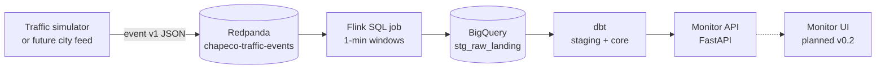

# CSMP Architecture

**Version:** 0.1 — aligns with [`01-requirements.md`](01-requirements.md)

---

## 1. Context diagram



---

## 2. Components

| Component | Responsibility | Requirement |
|-----------|----------------|-------------|
| **Producer** | Emit `chapeco-traffic-event` v1 | FR-001 |
| **Redpanda** | Durable log, replay | NFR-003 |
| **Flink job** | Windowed aggregation, event time | FR-002 |
| **BigQuery landing** | Store aggregates | FR-002 |
| **dbt staging** | Cast, rename, quality | FR-002 |
| **dbt core** | Join seed, bottleneck flag, GIS point | FR-004, FR-005 |
| **Monitor API** | Read core, freshness in `/health` | FR-003, NFR-001 |
| **Seed** | Static intersection coordinates | FR-005 |

---

## 3. Data flow (logical)

```
1. Event emitted (simulator)
      key: intersection_id
      value: chapeco-traffic-event v1

2. Flink: watermark + 1-min tumble
      GROUP BY intersection_id, TUMBLE(event_timestamp, 1 MINUTE)
      signal_state = LAST_VALUE(state ORDER BY event_timestamp)
      → landing table row grain (intersection_id, window_end)

3. dbt stg_traffic_signals (view)
      cast types, upper signal_state

4. dbt core_traffic_signals (incremental merge)
      join seed_chapeco_intersection_locations
      compute is_severe_bottleneck
      ST_GEOGPOINT(lon, lat)

5. Monitor API
      latest window_end per intersection_id
      expose JSON per monitor.v1.openapi.yaml
```

---

## 4. Network (local dev)

| Service | Host port | Internal |
|---------|-----------|----------|
| Redpanda Kafka | **19092** | redpanda:9092 |
| Redpanda Console | 8080 | optional |
| Flink JobManager UI | 8081 | optional |
| Monitor API | 8000 | api:8000 |

**Constitution:** producer and Flink configs MUST reference the same bootstrap address
(documented in compose: host `localhost:19092`, in-network `redpanda:9092`).

---

## 5. Time semantics

| Concept | Choice |
|---------|--------|
| Event time field | `environment.timestamp` → `event_timestamp` |
| Watermark | 10 seconds (configurable in implementation plan) |
| Window | Tumbling 1 minute |
| Monitor "current" | Row with max `window_end` per `intersection_id` where freshness OK |

---

## 6. Failure modes

| Failure | Behavior |
|---------|----------|
| Invalid event JSON | Route to DLQ topic `chapeco-traffic-events-dlq` (implementation) |
| OSM fetch fails | Use fallback seed; log warning |
| Flink down | Events buffer in Redpanda (retention TBD, min 24h dev) |
| BQ unavailable | Flink checkpoint + retry; alert on lag |
| Stale core data | `/health` reports `freshness_status: STALE` |

---

## 7. Technology choices (v0.1 baseline)

| Layer | Choice | Rationale |
|-------|--------|-----------|
| Broker | Redpanda (Kafka protocol) | Same as FinOps portfolio skill |
| Stream | PyFlink SQL | Matches spike; SQL for windows |
| Warehouse | BigQuery | Free tier target in original vision |
| Transform | dbt | Tests + lineage on core |
| Monitor API | FastAPI | OpenAPI contract-first |
| GIS | BigQuery `ST_GEOGPOINT` | Native in core model |

---

## 8. Not in v0.1 architecture

- Silver layer (optional v0.2 if multiple raw sources)
- Schema Registry (JSON Schema in repo is source of truth for v0.1)
- Kubernetes (docker compose only)
